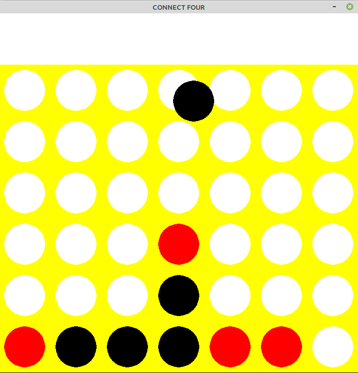

# Connect Four!

  

Connect Four is a classic for kids. The game is played by placing a piece in one of the seven slots
until it lands on another piece. Players alternate turns by placing one piece. 
The objective is to get four in a row/col/diag. The first player
to do this wins. You can play connect four against a computer. 

# Description

The CPU searches 5 depths down by default(can change in source code), and uses the minimax algorithm
with alpha-beta pruning to speed up the process. Still it takes a few seconds to process. 

# How To Play

First, players are randomly assigned a color and a turn for who goes first. Just **left-click** on the column you want to place your piece. It doesn't matter the row, the piece will fall. To win, just
get 4 in-a-row. Once accomplished, the game will print out "someone won", but you have to click on exit and 
restart to play again.

# Requirements

We need to install some libraries.
```bash
pip install pygame numpy
```
We also need python3 installed

# To play
Run
```bash 
cd src
python3 connect4.py
```

# Too easy or Too hard?

You can play around with board-analysis.py and play against yourself to analyze different board settings. Just type:
```
cd src
python3 board-analysis.py
```
To __undo__ a move, **right-click** anywhere, and the board will revert back to one state before. As you play against yourself, the console will display the current board score. High positives mean that red is winning, and High negatives suggest that black is winning. By tweaking with the numbers in the **python3** def winning **function** in the **board** class in the game.py file, you will find that numbers to tweak based on the comments I have made.
